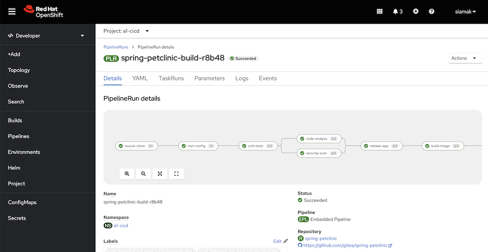

# CI/CD Demo with Tekton and Argo CD on OpenShift

This repo is a CI/CD demo using [Tekton Pipelines](http://www.tekton.dev) for continuous integration and [Argo CD](https://argoproj.github.io/argo-cd/) for continuous delivery on OpenShift which builds and deploys the [Spring PetClinic](https://github.com/spring-projects/spring-petclinic) sample Spring Boot application. This demo creates:

* 3 namespaces for CI/CD, DEV and STAGE projects
* 1 Tekton pipeline for building the application image on every Git commit
* Argo CD (login with OpenShift credentials)
* Gitea git server (username/password: `gitea`/`openshift`)
* Sonatype Nexus (username/password: `admin`/`admin123`)
* SonarQube (username/password: `admin`/`admin`)
* Git webhooks for triggering the CI pipeline

<p align="center">
  
</p>

## Prerequisites

* OpenShift GitOps 1.6
* OpenShift Pipelines 1.8
* Pipelines as code nightly release

The current version of this demo requires the unreleased version of pipelines-as-code which will be included in OpenShift Pipelines 1.9. In order to install the nightly release of pipelines-as-code, run the following command:

```
kubectl patch tektonconfig config --type="merge" -p '{"spec": {"addon":{"enablePipelinesAsCode": false}}}'
kubectl apply -f https://raw.githubusercontent.com/openshift-pipelines/pipelines-as-code/nightly/release.yaml
```


## Continuous Integration

On every push to the `spring-petclinic` git repository on Gitea git server, the following steps are executed within the Tekton pipeline:

1. Code is cloned from Gitea git server and the unit-tests are run
1. Unit tests are executed and in parallel the code is analyzed by SonarQube for anti-patterns, and a dependency report is generated
1. Application is packaged as a JAR and released to Sonatype Nexus snapshot repository
1. A container image is built in DEV environment using S2I, and pushed to OpenShift internal registry, and tagged with `spring-petclinic:[branch]-[commit-sha]` and `spring-petclinic:latest`
1. Kubernetes manifests are updated in the Git repository with the image digest that was built within the pipeline
1. A pull-requested is created on config repo for merging the image digest update into the STAGE environment


## Continuous Delivery

Argo CD continuously monitor the configurations stored in the Git repository and uses [Kustomize](https://kustomize.io/) to overlay environment specific configurations when deploying the application to DEV and STAGE environments.


## Deploy

1. Get an OpenShift cluster via https://try.openshift.com
1. Install OpenShift GitOps Operator
1. Download [OpenShift CLI](https://mirror.openshift.com/pub/openshift-v4/clients/ocp/latest/) and [Tekton CLI](https://github.com/tektoncd/cli/releases)
1. Deploy the demo

    ```text
    $ oc new-project demo
    $ git clone https://github.com/siamaksade/openshift-cicd-demo
    $ demo.sh install
    ```

1. Start the deploy pipeline by making a change in the `spring-petclinic` Git repository on Gitea, or run the following:

    ```text
    $ demo.sh start
    ```

1. Check pipeline run logs

    ```text
    $ tkn pipeline logs petclinic-build -L -f -n demo-cicd
    ```





## Demo Instructions

1. Go to spring-petclinic Git repository in Gitea
1. Log into Gitea with username/password: `gitea`/`openshift`
1. Edit a file in the repository and commit to trigger the pipeline
1. Check the pipeline run logs in Dev Console or Tekton CLI:

   ```text
   $ tkn pipeline logs petclinic-build -L -f -n demo-cicd
   ```

1. Once the pipeline finishes successfully, the image reference in the `spring-petclinic-config/environments/dev` are updated with the new image digest and automatically deployed to the DEV environment by Argo CD. If Argo CD hasn't polled the Git repo for changes yet, click on the "Refresh" button on the Argo CD application.

1. Login into Argo CD dashboard and check the sync history of `dev-spring-petclinic` application to verify the recent deployment

1. Go to the pull requests tab on `spring-petclinic-config` Git repository in Gitea and merge the pull-requested that is generated for promotion from DEV to STAGE

    

1. Check the sync history of `stage-spring-petclinic` application in Argo CD dashboard to verify the recent deployment to the staging environment. If Argo CD hasn't polled the Git repo for changes yet, click on the "Refresh" button on the Argo CD application.

## Troubleshooting

**Q: Why am I getting `unable to recognize "tasks/task.yaml": no matches for kind "Task" in version "tekton.dev/v1beta1"` errors?**

You might have just installed the OpenShift Pipelines operator on the cluster and the operator has not finished installing Tekton on the cluster yet. Wait a few minutes for the operator to finish and then install the demo.


**Q: why do I get `Unable to deploy revision: permission denied` when I manually sync an Application in Argo CD dashboard?**

When you log into Argo CD dashboard using your OpenShift credentials, your access rights in Argo CD will be assigned based on your access rights in OpenShift. The Argo CD instance in this demo is [configured](https://github.com/siamaksade/openshift-cicd-demo/blob/main/argo/argocd.yaml#L21) to map `kubeadmin` and any users in the `ocp-admins` groups in OpenShift to an Argo CD admin user. Note that `ocp-admins` group is not available in OpenShift by default. You can create this group using the following commands:

```
# create ocp-admins group
oc adm groups new ocp-admins

# give cluster admin rightsto ocp-admins group
oc adm policy add-cluster-role-to-group cluster-admin ocp-admins

# add username to ocp-admins group
oc adm groups add-users ocp-admins USERNAME
```